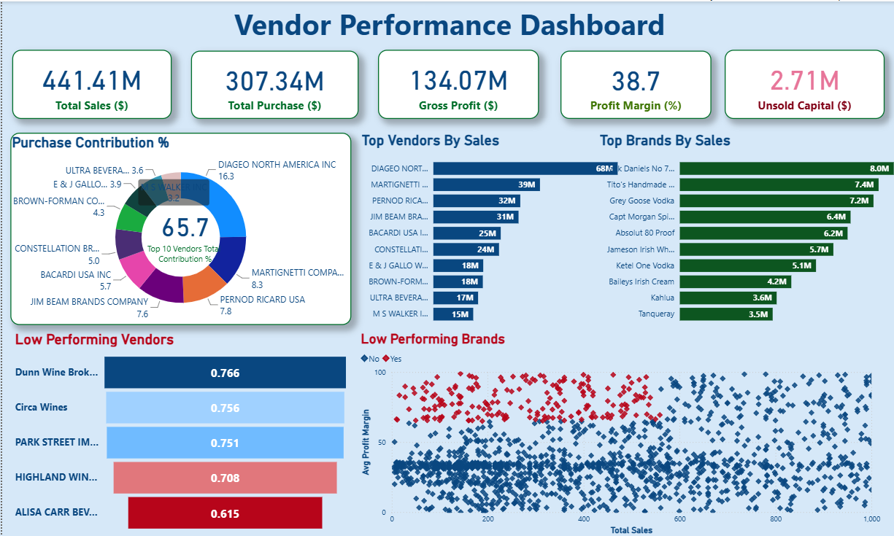

# Vendor Performance Analysis | SQL, Python & Power BI

An end-to-end retail analytics project that converts purchasing, sales, inventory, and freight data into vendor-level performance insights. It combines a reproducible SQLite pipeline, exploratory analysis in Python, and an interactive Power BI report.


## Business objective

Help procurement and retail leaders answer practical questions:

- Which vendors and brands drive sales, purchasing spend, and gross profit?
- How concentrated is purchasing among the largest suppliers?
- Which products combine low sales with high margins and may benefit from promotion?
- Where is capital tied up in slow-moving inventory?
- How do order-size groups relate to unit purchasing cost?

## Solution architecture

```text
Raw CSV files → SQLite ingestion → vendor-brand summary → Python EDA → Power BI dashboard
     data/          inventory.db       vendor_sales_summary    notebooks/     dashboard/
```

The summary is deliberately built at **vendor-brand** grain. Purchase-price records are matched by both vendor and brand to avoid many-to-many duplication. Vendor freight is allocated across each vendor's brands in proportion to purchase dollars, so summing the allocated freight remains valid.

## Repository structure

```text
├── dashboard/
│   └── vendor_performance.pbix
├── data/
│   └── README.md                 # expected source files and schema
├── images/
├── logs/
├── notebooks/
│   ├── Exploratory Data Analysis.ipynb
│   └── Vendor Performance Analysis.ipynb
├── scripts/
│   ├── ingestion_db.py
│   └── get_vendor_summary.py
├── requirements.txt
└── Vendor Performance Report.pdf
```

## Dashboard



The Power BI report surfaces vendor sales, profitability, purchase distribution, inventory turnover, and procurement KPIs for business users.

## Getting started

### 1. Create an environment and install dependencies

```bash
python -m venv .venv
# Windows PowerShell
.venv\Scripts\Activate.ps1
pip install -r requirements.txt
```

### 2. Add the source data

Source CSVs are excluded because of sharing restrictions. Put them in `data/` using the filenames and schema described in [data/README.md](data/README.md):

```text
data/purchases.csv
data/purchase_prices.csv
data/sales.csv
data/vendor_invoice.csv
```

### 3. Run the pipeline

```bash
python scripts/ingestion_db.py
python scripts/get_vendor_summary.py
jupyter notebook
```

Then open either notebook for the analysis and `dashboard/vendor_performance.pbix` in Power BI Desktop.

### 4. Validate the aggregation logic

```bash
pytest
```

The regression test checks that a brand shared by different vendors does not duplicate purchases and that allocated freight reconciles to the vendor freight total.

## Key metrics

| Metric | Definition |
|---|---|
| Gross Profit | Total sales dollars − total purchase dollars |
| Net Profit After Freight | Gross profit − allocated freight cost |
| Profit Margin | Gross profit / total sales dollars |
| Stock Turnover | Total sales quantity / total purchase quantity |
| Sales-to-Purchase Ratio | Total sales dollars / total purchase dollars |

`AllocatedFreightCost` is an analytical allocation, not an invoice-level cost. The project keeps it separate from gross profit so each margin definition is transparent.

## Analytical notes

- The notebooks explore distributions, outliers, correlations, vendor concentration, inventory turnover, and margin differences.
- Order-size analysis is descriptive: it shows associations with unit cost, not causal savings. A price comparison should control for product and supplier before being used as a procurement policy.
- Sales and purchase periods must be aligned before treating purchased-minus-sold units as exact unsold inventory.

## Tech stack

Python, Pandas, SQLite, NumPy, Matplotlib, Seaborn, SciPy, Jupyter, and Power BI.

## Portfolio context

This project demonstrates data ingestion, SQL modeling, data-quality-aware metric design, exploratory analysis, statistical reasoning, and executive dashboarding. Raw data is not distributed; the data contract and scripts are included so an authorized user can reproduce the workflow.

## Author

**Juan García** — Data Analyst
https://www.linkedin.com/in/juan-felipe-garc%C3%ADa-garc%C3%ADa-9a167912a/
https://github.com/felipegarcia123
